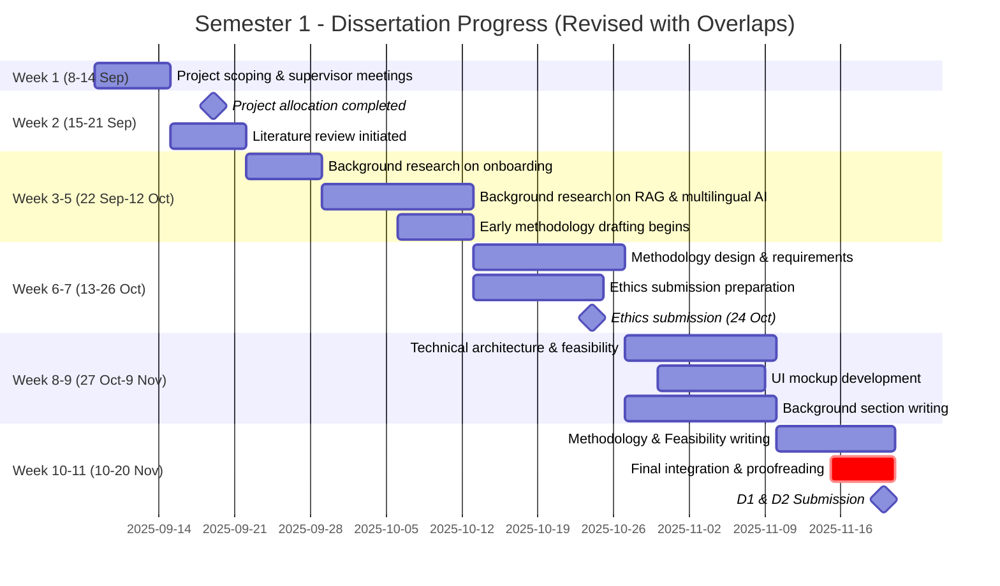
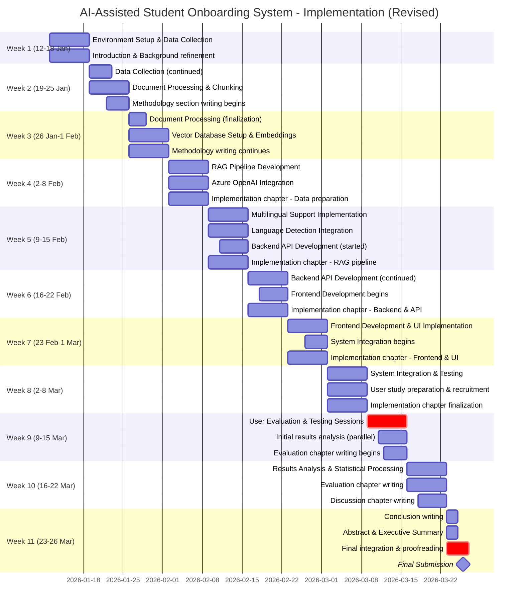

# AI-Assisted Student Onboarding System - REVISED TIMELINES

## Semester 1 Timeline (8 September - 20 Nov 2025)

## Semester 2 Timeline (12 January - 26 March 2026) - REVISED

Implementation timeline with realistic overlaps and continuous writing throughout.

- **Frontend**: React/Vue.js
- **Languages**: English, Mandarin, Hindi, Arabic
