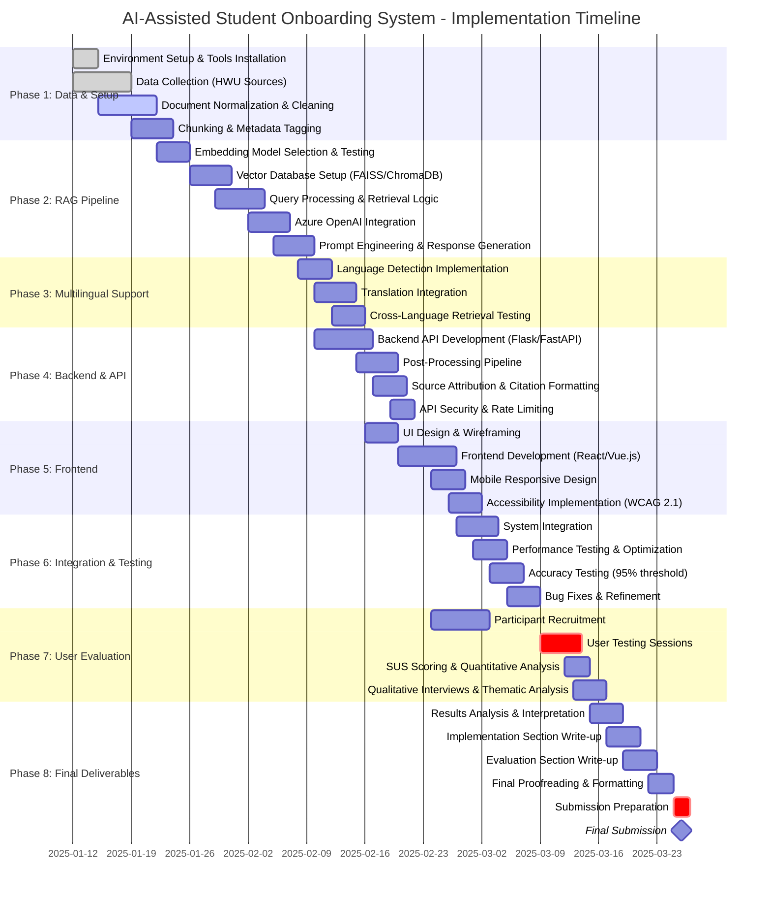

# AI-Assisted Student Onboarding System

## Project Timeline (January 12 - March 26, 2025)

Implementation timeline for the AI-powered onboarding application for Heriot-Watt University new and international students.

## Key Milestones

- **March 9-13**: User Testing Sessions (Critical)
- **March 26**: Final Submission Deadline

## Technologies

- **Backend**: Flask/FastAPI, Azure OpenAI Service
- **Vector Database**: FAISS/ChromaDB
- **Frontend**: React/Vue.js
- **Languages**: English, Mandarin, Hindi, Arabic
