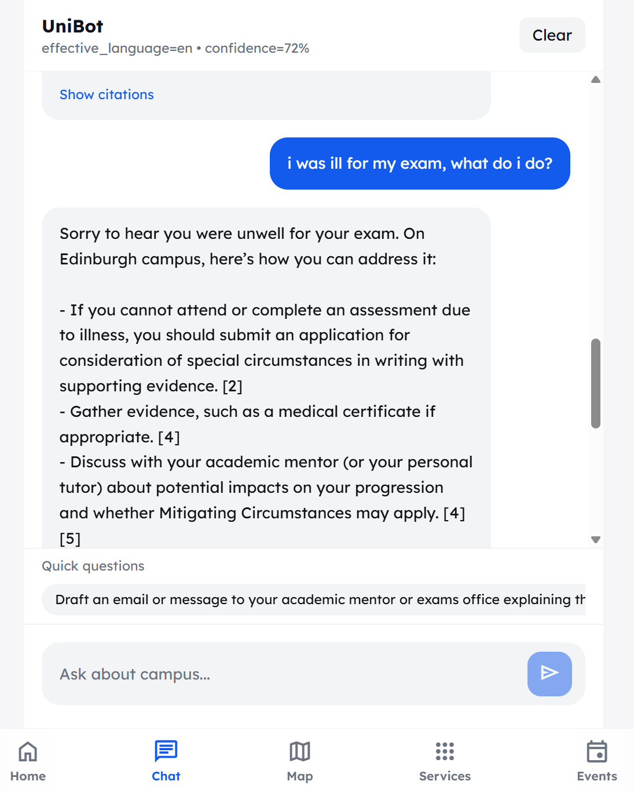
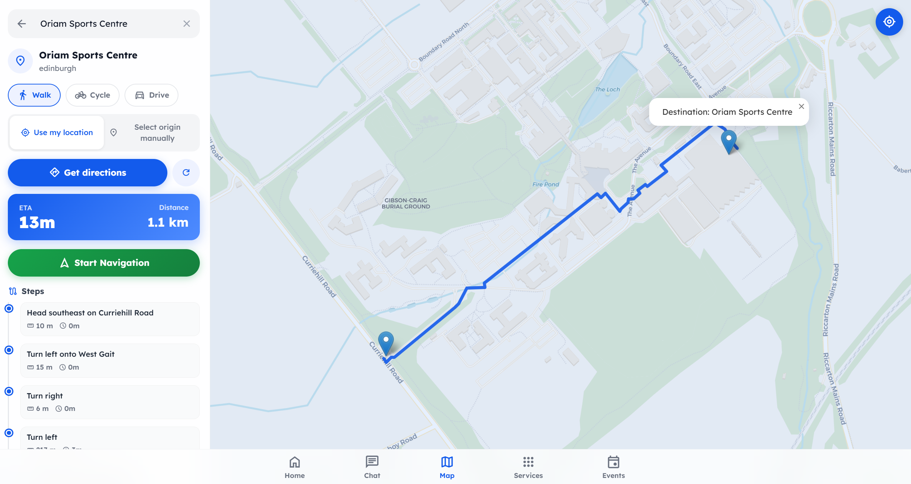
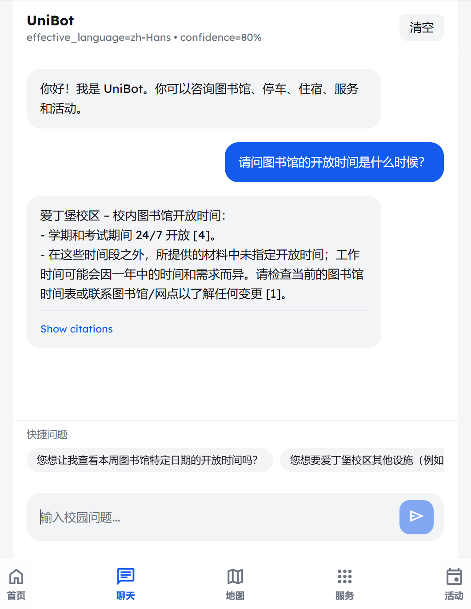

# UniBot - Supporting New Students on Campus

UniBot is a chatbot that helps new students settle into life at Heriot-Watt University. Students can ask questions about university services, find places on campus and get walking directions. They can also use the chatbot in different languages, which is particularly useful for international students.

I developed UniBot as part of my final-year Computer Science dissertation. The project explores how artificial intelligence can make university information easier to find and help students feel more confident in an unfamiliar place.

## What can UniBot help with?

- Students can ask questions about university services, facilities and everyday campus life.
- The chatbot looks through collected university information to help answer questions and provides links to its sources.
- Students can continue a conversation with follow-up questions instead of starting again each time.
- Students can ask questions in different languages and receive answers in a suitable language.
- Students can search for campus locations and request walking directions.

UniBot is a student research project. Its university information was collected during development, so some details may have changed. Students should check the linked university sources when they need up-to-date information.

## What does it look like?

These screenshots show the main chat screen, the campus map and a conversation in another language.

| Asking a question | Finding a place on campus | Chatting in another language |
| --- | --- | --- |
|  |  |  |

## How does it work?

When a student asks a question, UniBot can search the university information saved with the project. It uses an artificial intelligence service to help turn the relevant information into an answer. It also keeps track of the conversation so that the student can ask follow-up questions.

The application opens in a web browser, while a Python program runs on the computer to handle questions and look up information. A separate service called OpenRouteService provides walking directions.

## How to run UniBot on your computer

### What you need before starting

You will need a copy of this project, an internet connection and Python version 3.11 or newer installed on your computer. Python is the software used to run the main part of the application.

You will also need access to either OpenAI or Azure OpenAI. These services provide the artificial intelligence used to answer questions. They give you an API key, which is a private access code that allows the application to use your account. Walking directions require a separate access code from OpenRouteService.

### Start the application

1. Open the project folder on your computer. This is the folder that contains `start.py`.
2. Open a terminal in that folder. A terminal is a window where you type commands; on Windows, you can use PowerShell.
3. Type the following command and press Enter.

```console
python start.py
```

The first run prepares a separate space for the application's software and installs the packages it needs. It also creates a settings file called `.env` inside the `agentic_rag` folder, if that file does not already exist.

When the program asks you to fill in the settings, open `agentic_rag/.env` in a text editor. Add the account details described below, save the file and run `python start.py` again.

Once the application starts, open [UniBot on your computer](http://localhost:8000) in your browser. This address only works while the program is running. Keep the terminal open while you use UniBot. When you have finished, press Ctrl+C in the terminal to stop it.

### Fill in your account details

The example settings are prepared for Azure OpenAI. If you use Azure, replace the example values with the details from your own Azure account.

| Setting in the file | What you need to enter |
| --- | --- |
| `AZURE_OPENAI_API_KEY` | Enter the private access key for your Azure OpenAI service. |
| `AZURE_OPENAI_ENDPOINT` | Enter the web address of your Azure OpenAI service. |
| `AZURE_OPENAI_CHAT_DEPLOYMENT` | Enter the name you gave the Azure model that answers questions. |
| `AZURE_OPENAI_EMBEDDING_DEPLOYMENT` | Enter the name you gave the separate Azure model that helps the application search its information. |
| `ORS_API_KEY` | Enter your OpenRouteService access key if you want to use walking directions. |

If you use OpenAI directly, change `USE_AZURE_OPENAI` to `false` and enter your access key beside `OPENAI_API_KEY`. You can then leave the Azure account details unused.

Keep these access keys private. The project is set up so that your `.env` file is not included when you upload changes to GitHub.

### Prepare the saved university information

The example settings point to the university information already included with this project. Before asking questions about that information, use the following steps to prepare it for searching.

1. Start UniBot and open its [service controls](http://localhost:8000/docs) in your browser.
2. Find the section labelled `POST /ingest` and open it. This is the control that prepares the saved information for searching.
3. Select **Try it out**, leave the request as `{"force": false}` and select **Execute**.
4. Wait for a successful response, then return to the chatbot.

You may need to repeat this step if you replace or update the saved university information. The more detailed [setup notes](agentic_rag/README.md) explain the settings and files used by the application.

## What is included in this project?

The folders separate the working application from the research, results and earlier experiments.

| File or folder | What you will find there |
| --- | --- |
| `agentic_rag/` | This folder contains the main program, saved university information, campus locations and automated checks. |
| `index.html` | This file contains the page that students see in their web browser. |
| `images/` | This folder contains the screenshots shown on this page and in the presentation. |
| `scripts/` | This folder contains tools used to collect information from websites and save their text. |
| `data/` | This folder contains collected website information and the versions that were reviewed and prepared for use. |
| `evaluation/` | This folder contains the program used to test example questions and the results saved in April. |
| `docs/` | This folder contains explanations of the project, its development history and the presentation. |
| `archive/` | This folder contains earlier experiments that are kept for reference but are not part of the current application. |
| `Gantt Chart/` | This folder contains the original project timetable. |

## How was the application checked?

The project includes 16 automated checks for parts of the program, such as how it handles questions and campus directions. These checks use example responses instead of contacting the external services. They all passed when the project was organised for publication.

If you have set up the project's Python environment and want to run these checks yourself, use this command from the main project folder:

```console
python -m pytest agentic_rag/tests -q -p no:cacheprovider
```

A separate test program sends ten example questions to the running application. It records details such as how long answers take and whether they include sources. These tests use the real services, so they require working account details and may incur usage charges.

```console
python evaluation/run_evaluation_tests.py
```

The [results saved in April](evaluation/results/baseline-2026-04-09.json) are kept separately from new results. New runs normally save their results in `evaluation/results/latest.json`, which is not uploaded to GitHub automatically. The [testing notes](evaluation/README.md) explain what the results can and cannot tell us about the application.

## Where can I read more?

- The [project timetable](Gantt%20Chart/README.md) shows the planned stages of the dissertation.
- The [presentation](docs/presentation.html) gives an overview of the project. Download the project and open this file in a browser to view it with its images.
- The [development history](docs/development-history.md) explains how the saved project versions were used to put together the GitHub history.
- The [information collection notes](data/README.md) explain where the saved university information came from.
- The [system explanation](docs/architecture.md) describes how the main parts of the application work together.
- The [main program notes](agentic_rag/README.md) and [web page notes](docs/frontend-integration.md) provide more technical detail for anyone who wants to work on the code.
- The [earlier experiments](archive/README.md) show approaches explored before the current version.

The collected university material and reference documents keep their original source information and acknowledgements.
